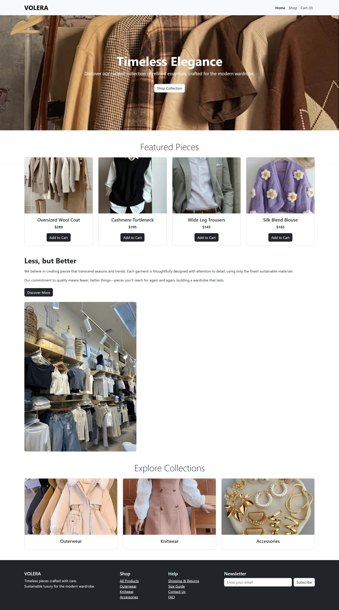

# 🛍️ Volera — React E-Commerce Store

<div align="center">


**A modern, minimal fashion e-commerce platform built with React.js**

[🔴 Live Demo](https://sakshimalkar.github.io/volera-react-ecommerce) · [📂 View Code](https://github.com/sakshimalkar/volera-react-ecommerce) 

</div>

---

## 📸 Preview

> *A clean, luxury fashion storefront — featuring product listings, cart, collections & newsletter.*



---

## ✨ Features

- 🏠 **Homepage** — Hero section, Featured Pieces, Collections grid
- 🛒 **Shopping Cart** — Add to cart functionality with item count
- 🗂️ **Collections** — Outerwear, Knitwear, Accessories categories
- 📧 **Newsletter** — Email subscription section
- 📱 **Responsive Design** — Works on all screen sizes
- ⚡ **Fast Loading** — Optimized React component architecture

---

## 🛠️ Built With

| Technology | Purpose |
|------------|---------|
| React.js | Frontend UI framework |
| JavaScript (ES6+) | Logic & interactivity |
| CSS3 | Styling & layout |
| React Router | Page navigation |
| GitHub Pages | Deployment & hosting |

---

## 🚀 Getting Started

### Prerequisites
- Node.js installed
- npm or yarn

### Installation

```bash
# Clone the repository
git clone https://github.com/sakshimalkar/volera-react-ecommerce.git

# Navigate into project
cd volera-react-ecommerce

# Install dependencies
npm install

# Start development server
npm start
```

---

## 💡 What I Learned

- Building **component-based architecture** with React
- Managing **state** across multiple components
- Implementing **React Router** for multi-page navigation
- **Deploying React apps** to GitHub Pages
- Writing **clean, reusable** UI components

---

## 🔮 Future Improvements

- [ ] Add backend with Django REST API
- [ ] User authentication & login
- [ ] Payment gateway integration
- [ ] Product search & filter
- [ ] Wishlist feature

---

## 👩‍💻 Author

**Sakshi Malkar**
- GitHub: [@sakshimalkar](https://github.com/sakshimalkar)
- LinkedIn: [https://www.linkedin.com/in/sakshi-malkar]
- Email: sakshimalkar286@gmail.com

---

<div align="center">

⭐ **If you like this project, give it a star!** ⭐

*Made with ❤️ by Sakshi Malkar*

</div>

